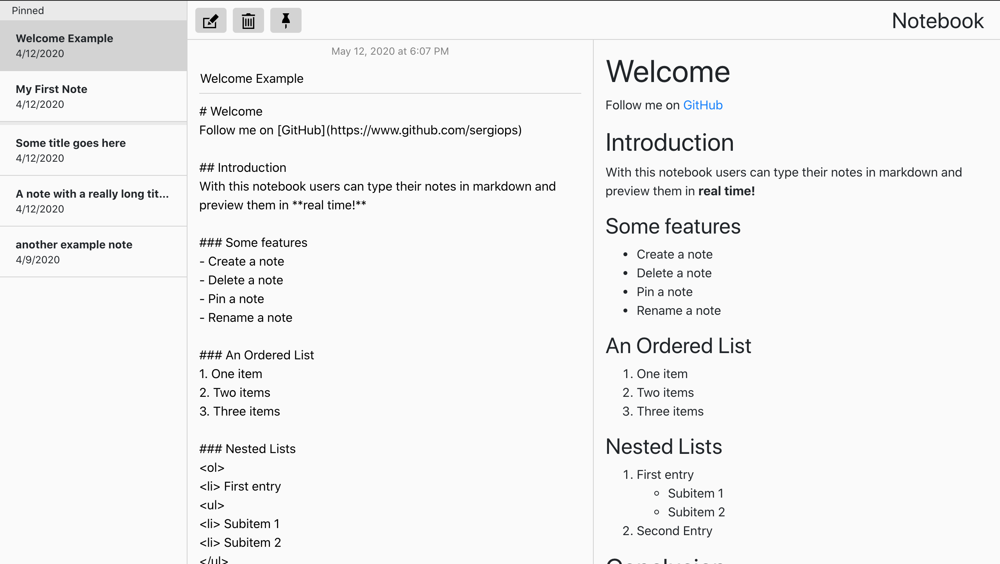

# Markdown Notebook

The notebook app allows users to write notes in markdown. The frontend was implemented using Vue.js and Bootstrap. 

## Requirements
- [x] Create a note.
- [x] Edit a note.
- [x] Delete a note.
- [x] Pin a note.
- [x] Rename a note.
- [x] Markdown is previewed in real time.
- [x] User can add multiple notes.
- [x] Notes are restored when the user opens the app at a later time.
- [x] Display the date and time when note was created.

## Preview

